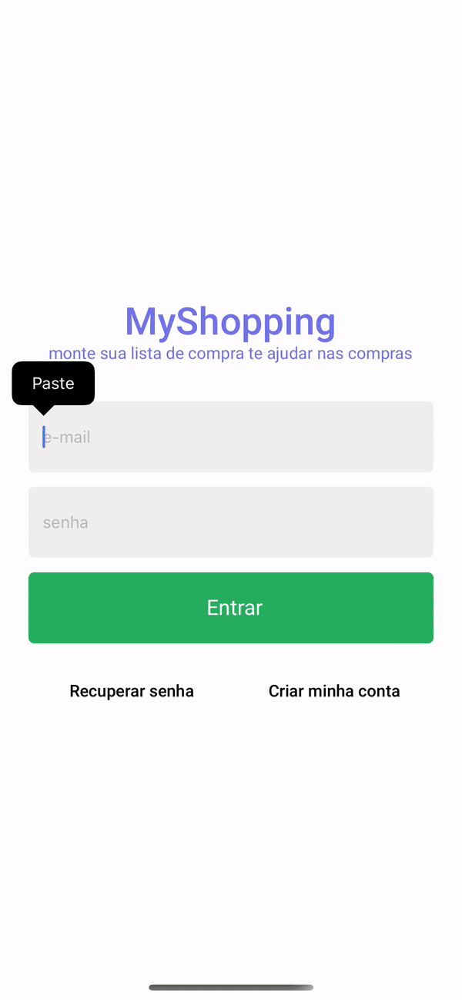

<h4 align="center">
    <h1 align="center">
      MyShopping
    </h1>
    <br><br>
</h4>

<h4 align="center">
    <br><br>
    <p align="center">
      <a href="#-about">About</a>&nbsp;&nbsp;&nbsp;|&nbsp;&nbsp;&nbsp;
      <a href="#-technologies">Technologies</a>&nbsp;&nbsp;&nbsp;|&nbsp;&nbsp;&nbsp;
      <a href="#-how-to-run-the-project">Run</a>&nbsp;&nbsp;&nbsp;|&nbsp;&nbsp;&nbsp;
      <a href="#-info">Info</a>&nbsp;&nbsp;&nbsp;|&nbsp;&nbsp;&nbsp;
      <a href="#-changelog">Changelog</a>&nbsp;&nbsp;&nbsp;|&nbsp;&nbsp;&nbsp;
      <a href="#-license">License</a>
  </p>
</h4>

<h1 align="center">
    
  <div>
</h1>

## 🔖 About

MyShopping é um aplicativo criado para entender os fundamentos do firebase.
Conta com uma interface simples e intuitiva para o usuário. As tecnologias utilizadas são:
Firebase auth;
Firebase storage;

## 🚀 Technologies

- [ReactNative](https://reactnative.dev/)
- [Expo](https://expo.io/)

## 🏁 How to run the project

#### Clone the repository

```bash
git clone https://github.com/rafinhaa/myshopping-rn-ignite.git
cd myshopping-rn-ignite
```

#### Install dependencies

```bash
yarn install
```

#### Build in iOS

```bash
cd ios && pod install && cd..
yarn run ios
```

#### Build in Android

```bash
yarn run android
```

## ℹ️ Info

É preciso ter uma conta no firebase e criar um projeto, criar o app para iOS e Android.
Fazer o download do arquivo de configuração do app do Android e mover para `android/app/google-services.json`

Fazer o download do arquivo de configuração do app do Android e mover para `ios/GoogleService-Info.plist`

## 📝 License

[MIT](LICENSE)

**Free Software, Hell Yeah!**
